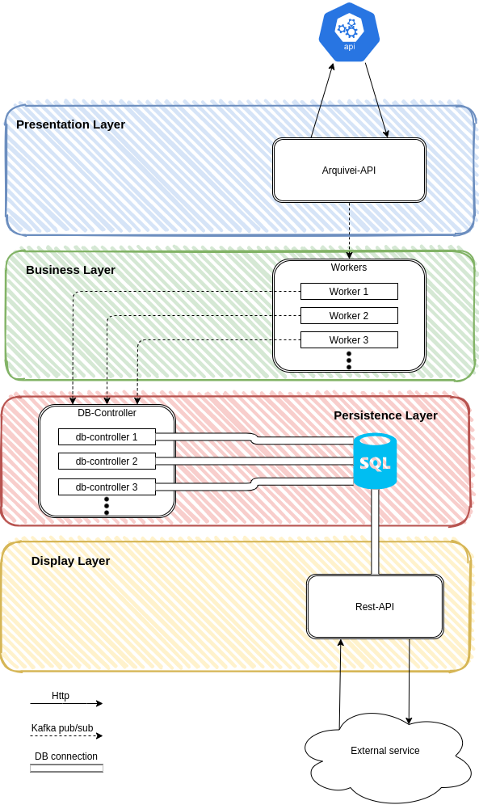

# Boltons

This application aims to collect NFe data and extract its amounts, placing it in a database and providing a route for easy access via HTTP request.

Observing the [NFe integration document](https://www.nfe.fazenda.gov.br/portal/exibirArquivo.aspx?conteudo=TIiR6jY8fsM=) provided by the Ministry of Finance, the field that corresponds to the amount in the XML is the id tag **W16**, which corresponds to the **vNF** field.

This software is based on a **microservice architecture**.

## Technologies

* [Golang - v1.13](https://golang.org/)
* [Golang Echo Server - v4.1.16](https://github.com/labstack/echo)
* [Docker - v18.09.5](https://www.docker.com/)
* [Docker-Compose - v1.23.1](https://docs.docker.com/compose/)
* [Apache Kafka - v5.0.0](https://kafka.apache.org/)
* [Kafkacat - v1.6.0](https://github.com/edenhill/kafkacat)
* [Confluentinc](https://www.confluent.io/)
* [zookeeper - v5.0.0](https://docs.confluent.io/current/zookeeper/operations.html)
* [PostgreSQL - v10.12](https://www.postgresql.org/)
* [PGAdmin4](https://www.pgadmin.org/)

## Architecture

As mentioned in the text above, this software is based on a **layered microservice architecture**, see the architecture in the image below:



### Arquivei API

This service interfaces with an external API, collecting NFes, is paralleled with **go routines** to make sending messages more efficient.

We receive the NFes by **HTTP request**, and send them to the workers via **Pub/Sub**.

### Workers

This service makes it our business rule, in this case, to collect the amount of an NFe. Workers **can be replicated** as many times as they like.
Workers receive and send messages via Pub/Sub.
:warning: Be aware of the number of replicas also on the topic of Pub/Sub, this can cause some bottleneck.

### DB Controller

This service interfaces with the database, it is useful if we want to change the bank, or add business rules. **It can be replicated** if there is a need.
We receive messages via Pub / Sub and save directly to the bank.
:warning: Be aware of the number of replicas also on the topic of Pub/Sub, this can cause some bottleneck.

### Rest API

This service only exposes the data collected by an **HTTP** request, talks directly to the database, and is not affected if the collection service stops.

## Run

To run the application you must first verify that [Docker](https://docs.docker.com/engine/install/ubuntu/) and [Docker-Compose](https://docs.docker.com/compose/install/) are installed on your pc. If not click on the links and install them.

After that, we insert the Arquivei API credentials in the arquivei-api/credentials.yaml file. In this way:
```yaml
api-id: your api id here
api-key: your api key here
```

And execute the command:
```bash
make run
```

:warning: If you have problems with Apache Kafka, due to the Docker IP Host, try to execute the code as follows:

Collect the information from the network interface of the docker, for that we can use the `ifconfig -a` command, obtaining a result similar to this:

```bash
docker0: flags=4099<UP,BROADCAST,MULTICAST>  mtu 1500
        inet 172.17.0.1  netmask 255.255.0.0  broadcast 172.17.255.255
        ether 02:42:1e:43:37:bc  txqueuelen 0  (Ethernet)
        RX packets 0  bytes 0 (0.0 B)
        RX errors 0  dropped 0  overruns 0  frame 0
        TX packets 0  bytes 0 (0.0 B)
        TX errors 0  dropped 0 overruns 0  carrier 0  collisions 0

enp1s0: flags=4163<UP,BROADCAST,RUNNING,MULTICAST>  mtu 1500
        inet 192.168.0.36  netmask 255.255.255.0  broadcast 192.168.0.255
        inet6 fe80::db5c:96f9:7f1a:35b5  prefixlen 64  scopeid 0x20<link>
        ether e0:d5:5e:f2:2e:19  txqueuelen 1000  (Ethernet)
        RX packets 243839  bytes 139219891 (139.2 MB)
        RX errors 0  dropped 0  overruns 0  frame 0
        TX packets 204874  bytes 35852750 (35.8 MB)
        TX errors 0  dropped 0 overruns 0  carrier 0  collisions 0
```
We look for the docker inet. In this case, our IP for the docker is **172.17.0.1**.

Finally we can run our application using the command:
```bash
DOCKER_HOST_IP=172.17.0.1 docker-compose up --build
```

:warning: Check if ports **5002** and **16543** are available, you need it to run our rest-api and pgadmin4 respectively.

:warning: Maybe you need to **clean up the docker-compose** for the application to run as expected, for that you can run the command:
```bash
docker-compose down
docker rm -f $(docker ps -a -q)
docker volume rm $(docker volume ls -q)
```
:warning: During the build of the codes in go, it can fail to get the library, and yes, they do not have a retry for that, if that happens, **clean the docker compose** and re run the application.


### Testing

You can run some tests by checking the database on **PGAdmin4** where user and password is"haha1212" and the user of database server are "postgres" and the password is "haha1212", or by collecting the amount of NFes using the following command:
```bash
curl localhost:5002/nfe/amount/:accessKey
```
Some examples of access keys:
```
33131054759614000180550010000016541564683041
31140130290824000104550010000013671000013676
41171130290824000104550010000544291448314562
```

